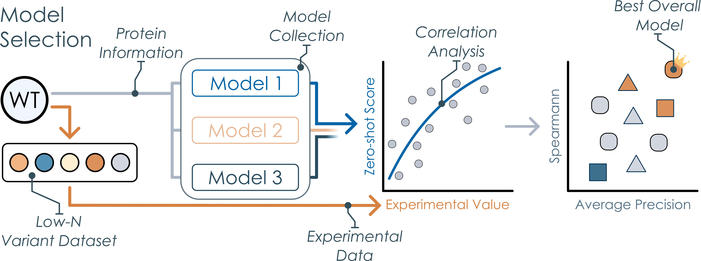
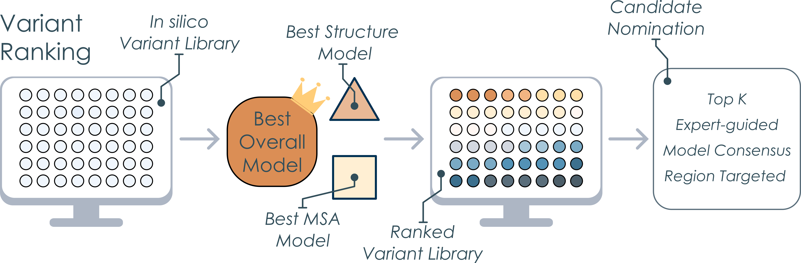

# Protein Ranking using Informed Zero-shot Modelling
Protein Ranking using Informed Zero-shot Modelling (PRIZM) is a two-phase approach that efficiently examines the mutational space using machine learning (ML) guidance without requiring high-throughput methods. PRIZM combines the specific information of small datasets with the general knowledge of pre-trained zero-shot predictors to discover enhanced protein variants, thereby removing the need for large datasets common in traditional ML techniques.

PRIZM provides the necessary tools to implement all elements of the workflow easily. In the **Model Selection Phase**, the protein information of an experimental low-N dataset is parsed through a diverse collection of zero-shot models based on the [ProteinGym](https://github.com/OATML-Markslab/ProteinGym) code. The resulting predicted scores are correlated with the original experimental values, identifying the model most suitable for predicting better mutants. In the **Variant Ranking Phase**, PRIZM can be used to create, predict, and rank a large _in silico_ mutant dataset using the models identified as most suitable in the previous phase. Visualization tools are also provided, such as the plotting of individual correlations, comparisons of model performances, or the construction of single-mutant landscapes. For more information on all tools available in PRIZM, please see the example notebook.

Importantly, the best models identified by PRIZM consistently outperform the worst models across ten diverse benchmark datasets, such as protein aggregation or enzyme activity, using as few as 20 variants in the low-N dataset.

## Installation
Before installing PRIZM, make sure either Anaconda or Miniconda is installed, as this will be used to manage the environments. To install PRIZM, clone (or fork and clone) the repository:
```bash
git clone https://github.com/daha-la/PRIZM.git
```
To run the zero-shot models in the [Modeller Module](ModellerModule/), we recommend installing PRIZM on a remote Linux server, as some of the models require significant computational power. 

### Environments
To run the notebooks found in the [notebook folder](./notebooks/), please create the following environment:
```bash
conda env create -f environments/PRIZM_notebook_Mac.yaml
```
or
```bash
conda env create -f environments/PRIZM_notebook_Windows.yaml
```
On the machine/server running the zero-shot models, please create the full PRIZM environment:
```bash
conda env create -f environments/PRIZM.yaml
conda activate PRIZM
pip install evcouplings
```
Please note that the full PRIZM environment requires a Linux-based system. 

Some models require dedicated environments to run:
#### GEMME
```bash
conda env create -f environments/GEMME.yml
```
#### MULAN
```bash
conda env create -n mulan python=3.10
conda activate mulan
pip install -r environments/mulan.txt
```
#### ProSST
```bash
conda env create -n prosst python=3.10
conda activate prosst
pip install -r environments/prosst.txt
```
#### ProtSSN
```bash
conda env create -f protssn.yaml
conda activate protssn
pip install torch_scatter torch_sparse torch_cluster -f https://data.pyg.org/whl/torch-2.3.0+cu121.html
```
#### RSALOR
```bash
conda env create -n rsalor python=3.10
conda activate rsalor
pip install rsalor
```
#### UniRep
To conduct evotuning of the UniRep models, please create a dedicated environment.
```bash
conda env create -f environments/unirep_evotune.yaml
```
We also recommend running the scoring scripts for the UniRep models using this environment.
#### VenusREM
```bash
conda env create -f environments/venusrem.yaml
conda activate venusrem
pip install hmmer
pip install https://github.com/debbiemarkslab/EVcouplings/archive/develop.zip
```

### Checkpoints
Before running any models, please ensure that all model checkpoints have been downloaded. We recommend storing the checkpoints in the [checkpoints directory](./ModellerModule/checkpoints/). All checkpoints can be downloaded using [download script](./ModellerModule/checkpoints/download_checkpoints.sh). If a different checkpoint folder is used, please adapt the `checkpoint_folder` variable in the [zero-shot configuration file](ModellerModule/proteingym/scripts/zero_shot_config.sh). For more information, see the [checkpoints directory](./ModellerModule/checkpoints/).

### Tools
PRIZM requires the installation of several tools to run some of the zero-shot models, and we recommend installing these tools in the [installation directory](./ModellerModule/installation/) using the [installer script](./ModellerModule/installation/install_tools.sh). If a different installation folder is used, please adapt the `installation_folder` variable in the [zero-shot configuration file](ModellerModule/proteingym/scripts/zero_shot_config.sh). For more information, see the [installation directory](./ModellerModule/installation/).

## Protein Information
PRIZM requires both the sequence, structure, and MSA of the wildtype enzyme to function. For the structure, we recommend either using a high-quality crystal structure with no gaps or an _in silico_-predicted structure using the [AlphaFold3 web server](https://alphafoldserver.com/). For the MSA, PRIZM requires the MSA to be in a specific format (A2M, with no gaps/deletions in the query sequence), and we therefore recommend using the [EVcouplings web server](https://v2.evcouplings.org/) or running the tool locally.

## Run
PRIZM consists of multiple phases. In the pre-setup, first ensure that your low-N dataset is formatted correctly and saved in the [low-N folder](data/lowN/). Your dataset file should contain three columns:
- "mutant", a column containing all the mutants in the variant the format of {WT}{POS}{MUT}, separated by a colon such as M1A:S10A
- "mutated_sequence", a column containing the sequence of the variant
- "DMS_score", a column containing the experimental values of the variants
Secondly, save an AlphaFold structure (or crystal structure without gaps) in the [structure folder](data/protein_information/structure/), and an MSA in the a2m format in the [MSA folder](data/protein_information/msa/files/) (can be created using the [EVcouplings website](https://v2.evcouplings.org/)). Lastly, create a reference file using the [Reference Builder notebook](notebooks/Reference_builder.ipynb).



For the **Model Selection Phase** of PRIZM, all zero-shot model submission scripts can be found in the [submission folder](/ModellerModule/submission/), and all submission scripts should be run directly from this folder. We recommend using the [global submission script](./ModellerModule/submission/submit_zero_shot_global.sh) for running all models to handle dependencies and order logic. Please see the [README file](ModellerModule/submission/README.md) in the folder for a more in-depth description. After running all models, please run the **Model Selection Phase** part of the [PRIZM notebook](/notebooks/PRIZM.ipynb) to identify the best models that have the highest correlation with your low-N dataset.



In the **Variant Ranking Phase**, a large _in silico_ library can be created. This dataset is saved in the [_in silico_ library data folder](data/insilico_libraries/), and this large dataset can then be run using the best model identified in the previous phase. Please remember to update the reference file using the [Reference Builder notebook](notebooks/Reference_builder.ipynb) and change the data location variable in the [zero-shot configuration file](ModellerModule/proteingym/scripts/zero_shot_config.sh). The resulting ranked dataset can be examined using the [PRIZM notebook](/notebooks/PRIZM.ipynb) to select mutants for experimental validation.

## Collection of Zero-shot models
PRIZM leverages pre-trained zero-shot models developed and published by other research groups and adapted in the [ProteinGym](https://github.com/OATML-Markslab/ProteinGym) workflow. We do not claim any rights to their work or associated code.
| Model           | Model Input  | Repository URL                                                                                      | Reference                                                                                              |
|------------------|--------------|-----------------------------------------------------------------------------------------------------|--------------------------------------------------------------------------------------------------------|
| CARP            | Sequence     | [https://github.com/microsoft/protein-sequence-models](https://github.com/microsoft/protein-sequence-models) | [Yang, K.K. et al. (2024). Convolutions are competitive with transformers for protein sequence pretraining. Cell Systems.](https://www.sciencedirect.com/science/article/pii/S2405471224000292) |
| ESM-1b          | Sequence     | [https://github.com/facebookresearch/esm](https://github.com/facebookresearch/esm)                 | [Rives, A. et al. (2021). Biological structure and function emerge from scaling unsupervised learning to 250 million protein sequences. PNAS, 118.](https://www.pnas.org/doi/10.1073/pnas.2016239118) |
| ESM-1v          | Sequence     | [https://github.com/facebookresearch/esm](https://github.com/facebookresearch/esm)                 | [Meier, J. et al. (2021). Language models enable zero-shot prediction of the effects of mutations on protein function. NeurIPS.](https://proceedings.neurips.cc/paper/2021/hash/f51338d736f95dd42427296047067694-Abstract.html) |
| ESM-2           | Sequence     | [https://github.com/facebookresearch/esm](https://github.com/facebookresearch/esm)                 | [Lin, Z. et al. (2023). Evolutionary-scale prediction of atomic-level protein structure with a language model. Science, 379.](https://www.science.org/doi/10.1126/science.ade2574) |
| ProGen2         | Sequence     | [https://github.com/salesforce/progen](https://github.com/salesforce/progen)                       | [Nijkamp, E. et al. (2023). ProGen2: Exploring the Boundaries of Protein Language Models. Cell Systems.](https://www.sciencedirect.com/science/article/pii/S2405471223002727) |
| ProtGPT2        | Sequence     | [https://huggingface.co/nferruz/ProtGPT2](https://huggingface.co/nferruz/ProtGPT2)                 | [Ferruz, N. et al. (2022). ProtGPT2 is a deep unsupervised language model for protein design. Nature Communications, 13.](https://www.nature.com/articles/s41467-022-32007-7) |
| RITA            | Sequence     | [https://github.com/lightonai/RITA](https://github.com/lightonai/RITA)                             | [Hesslow, D. et al. (2022). RITA: a Study on Scaling Up Generative Protein Sequence Models. ArXiv.](https://arxiv.org/abs/2205.05789) |
| Tranception (no retrieval) | Sequence | [https://github.com/OATML-Markslab/Tranception](https://github.com/OATML-Markslab/Tranception) | [Notin, P. et al. (2022). Tranception: protein fitness prediction with autoregressive transformers and inference-time retrieval. ICML.](https://proceedings.mlr.press/v162/notin22a.html) |
| UniRep          | Sequence     | [https://github.com/churchlab/UniRep](https://github.com/churchlab/UniRep)                         | [Alley, E.C. et al. (2019). Unified rational protein engineering with sequence-based deep representation learning. Nature Methods.](https://www.nature.com/articles/s41592-019-0598-1) |
| EVE             | MSA          | [https://github.com/OATML-Markslab/EVE](https://github.com/OATML-Markslab/EVE)                     | [Frazer, J. et al. (2021). Disease variant prediction with deep generative models of evolutionary data. Nature.](https://www.nature.com/articles/s41586-021-04043-8) |
| eUniRep         | MSA          | [https://github.com/chloechsu/combining-evolutionary-and-assay-labelled-data](https://github.com/chloechsu/combining-evolutionary-and-assay-labelled-data) | [Biswas, S. et al. (2021). Low-N protein engineering with data-efficient deep learning. Nature Methods.](https://www.nature.com/articles/s41592-021-01100-y) |
| GEMME           | MSA          | [https://hub.docker.com/r/elodielaine/gemme](https://hub.docker.com/r/elodielaine/gemme)           | [Laine, E. et al. (2019). GEMME: A simple and fast global epistatic model. Bioinformatics.](https://pubmed.ncbi.nlm.nih.gov/31406981/) |
| TranceptEVE     | MSA          | [https://github.com/OATML-Markslab/ProteinGym](https://github.com/OATML-Markslab/ProteinGym)       | [Notin, P. et al. (2022). TranceptEVE: Combining Family-specific and Family-agnostic Models of Protein Sequences for Improved Fitness Prediction. NeurIPS, LMRL workshop.](https://www.biorxiv.org/content/10.1101/2022.12.07.519495v1) |
| MSA Transformer | MSA          | [https://github.com/rmrao/msa-transformer](https://github.com/rmrao/msa-transformer)               | [Rao, R. et al. (2021). MSA Transformer. ICML.](https://proceedings.mlr.press/v139/rao21a.html) |
| ESM-IF1         | Structure    | [https://github.com/facebookresearch/esm](https://github.com/facebookresearch/esm)                 | [Hsu, C. et al. (2022). Learning Inverse Folding from Millions of Predicted Structures. ICML.](https://proceedings.mlr.press/v162/hsu22a.html) |
| MIF             | Structure    | [https://github.com/microsoft/protein-sequence-models](https://github.com/microsoft/protein-sequence-models) | [Yang, K.K. et al. (2021). Masked inverse folding with sequence transfer for protein representation learning. Protein Engineering, Design and Selection.](https://academic.oup.com/peds/article/doi/10.1093/protein/gzad015/7330543) |
| MIF-ST          | Structure    | [https://github.com/microsoft/protein-sequence-models](https://github.com/microsoft/protein-sequence-models) | [Yang, K.K. et al. (2021). Masked inverse folding with sequence transfer for protein representation learning. Protein Engineering, Design and Selection.](https://academic.oup.com/peds/article/doi/10.1093/protein/gzad015/7330543) |
| MULAN           | Structure    | [https://github.com/DFrolova/MULAN](https://github.com/DFrolova/MULAN)                             | [Frolova, D. et al. (2025). MULAN: Multimodal protein representation learning. Bioinformatics Advances. ](https://academic.oup.com/bioinformaticsadvances/article/5/1/vbaf117/8139638) |
| ProteinMPNN     | Structure    | [https://github.com/dauparas/ProteinMPNN](https://github.com/dauparas/ProteinMPNN)                 | [Dauparas, J. et al. (2022). Robust deep learning-based protein sequence design using ProteinMPNN. Science.](https://www.science.org/doi/10.1126/science.add2187) |
| ProSST          | Structure    | [https://github.com/ai4protein/ProSST](https://github.com/ai4protein/ProSST)                       | [Li, M. et al. (2024). ProSST: Protein Language Modeling with Quantized Structure and Disentangled Attention. NeurIPS. ](https://www.proceedings.com/079017-1126.html) |
| ProtSSN         | Structure    | [https://github.com/ai4protein/ProtSSN](https://github.com/ai4protein/ProtSSN)                     | [Tan, Y. et al. (2025). Semantical and geometrical protein encoding toward enhanced bioactivity and thermostability. eLife.](https://elifesciences.org/articles/98033) |
| SaProt          | Structure    | [https://github.com/westlake-repl/SaProt](https://github.com/westlake-repl/SaProt)                 | [Su, J. et al. (2024). SaProt: Protein Language Modeling with Structure-aware Vocabulary. ICLR](https://proceedings.iclr.cc/paper_files/paper/2024/hash/1c42513b8895ab11fbbb5b7e8e6b6b02-Abstract-Conference.html) |
| RSALOR          | All          | [https://github.com/3BioCompBio/RSALOR](https://github.com/3BioCompBio/RSALOR)                     | [Tsishyn, R. et al. (2023). Residue conservation and solvent accessibility are (almost) all you need for predicting mutational effects in proteins. Bioinformatics.](https://academic.oup.com/bioinformatics/article/41/6/btaf322/8152299) |
| VenusREM        | All          | [https://github.com/ai4protein/VenusREM](https://github.com/ai4protein/VenusREM)                   | [Tan, Y. et al. (2024). From high-throughput evaluation to wet-lab studies: advancing mutation effect prediction with a retrieval-enhanced model. Bioinformatics.](https://academic.oup.com/bioinformatics/article/41/Supplement_1/i401/8199374) |


## Validation DMS datasets
All validation datasets were extracted from the [ProteinGym](https://github.com/OATML-Markslab/ProteinGym) benchmark library. We used the following datasets:
| ProteinGym ID                 | Protein                                    | DMS Property                  | Reference                                                                 |
|-----------------------------------|--------------------------------------------|--------------------------------|---------------------------------------------------------------------------|
| ANCSZ_Hobbs_2022                  | Tyrosine Kinase                            | Enzyme activity               | [Hobbs, H. T. et al.](https://pubmed.ncbi.nlm.nih.gov/36173161/)          |
| A4_HUMAN_Seuma_2022               | Amyloid beta                               | Aggregation                   | [Seuma, M et al.](https://www.nature.com/articles/s41467-022-34742-3)    |
| ADRB2_HUMAN_Jones_2020            | β<sub>2</sub>-adrenergic receptor          | Receptor activity (Transcription) | [Jones, E. M. et al.](https://elifesciences.org/articles/54895)          |
| ESTA_BACSU_Nutschel_2020          | Lipase A                                   | Thermostability               | [Nutschel, C. et al.](https://pubs.acs.org/doi/10.1021/acs.jcim.9b00954) |
| MK01_HUMAN_Brenan_2016            | Mitogen-activated protein kinase 1         | Inhibitor resistance          | [Brenan, L. et al.](https://www.sciencedirect.com/science/article/pii/S2211124716313171) |
| Q59976_STRSQ_Romero_2015          | β-glucosidase                              | Enzyme activity               | [Romero, P. A. et al.](https://www.pnas.org/doi/10.1073/pnas.1422285112) |
| SC6A4_HUMAN_Young_2021            | Sodium-dependent serotonin transporter     | Fluorescence                  | [Ellis, H. J. et al.](https://www.biorxiv.org/content/10.1101/2021.04.19.440442v2) |
| SPIKE_SARS2_Starr_2020_binding    | SARS-CoV-2 spike receptor binding domain   | Receptor binding              | [Starr, T. N. et al.](https://pubmed.ncbi.nlm.nih.gov/32841599/)         |
| VKOR1_HUMAN_Chiasson_2020_activity| Epoxide reductase                          | Enzyme activity               | [Chiasson, M. A. et al.](https://elifesciences.org/articles/58026)       |
| YAP1_HUMAN_Araya_2012             | Human Yes-associated protein               | Peptide binding               | [Araya, C. L. et al.](https://www.pnas.org/doi/10.1073/pnas.1209751109)  |

## Reproduction of Publication Figures
To reproduce all figures found in the two PRIZM publications, please run the notebooks in the [notebooks folder](notebooks/) or the [experimental validation folder](experimental_validation/). For the PRIZM analysis of the FlA, GmSuSy, and TOGT1_1, please see the [FlA PRIZM notebook](notebooks/PRIZM_FlA.ipynb), [GmSuSy PRIZM notebook](notebooks/PRIZM_FlA.ipynb), and [TOGT1_1 PRIZM notebook](notebooks/PRIZM_TOGT1_1.ipynb), respectively, while the PRIZM validation analysis can be found in the [validation notebook](notebooks/PRIZM_validation.ipynb). All experimental validation data is located in the [experimental validation folder](experimental_validation/). The experimental analysis of GmSuSy can be found in the [GmSuSy notebook](experimental_validation/GmSuSy_analysis.ipynb), while the analysis of TOGT1_1 can be found in the [TOGT1_1 notebook](experimental_validation/TOGT1_1.ipynb). The experimental analysis of FlA is divided into the characterization of [relative activity](experimental_validation/FlA_RelAct_analysis.ipynb), [kinetic parameters](experimental_validation/FlA_Kin_analysis.ipynb), [temperature optimumm](experimental_validation/FlA_Temp_Opt.ipynb), and [thermal stability](experimental_validation/FlA_Tm_analysis.ipynb).

## Contact
For any questions regarding PRIZM, please forward them to David Harding-Larsen at [dahala@dtu.dk](mailto:dahala@dtu.dk). For any collaboration proposals, please refer to Dr. Ditte Hededam Welner at [diwel@dtu.dk](mailto:diwel@dtu.dk) or Dr. Stanislav Mazurenko at [mazurenko@mail.muni.cz](mailto:mazurenko@mail.muni.cz).

## Acknowledgments
PRIZM was developed based on multiple open-source zero-shot models and builds on code from the [ProteinGym repository](https://github.com/OATML-Markslab/ProteinGym). We thank the authors of ProteinGym for making their framework publicly available under the MIT License.

## License
This project is available under the MIT license found in the [LICENSE file](LICENSE).